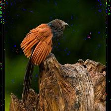
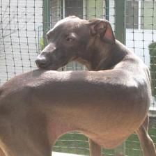
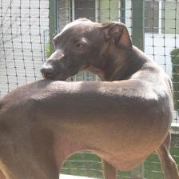
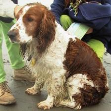
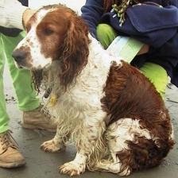

# DeepFool

Unofficial PyTorch implementation of DeepFool, and the construction of adversarial attacks on the validation set was achieved using the pre-trained ResNet-50 model.

| raw images                          | adversarial examples                 |
| ----------------------------------  | -----------------------------------  |
|    |    |
|  |  |
|  |  |
|  |  |
|    |    |

